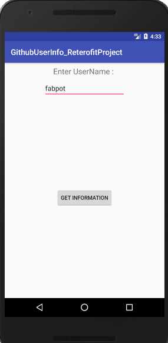
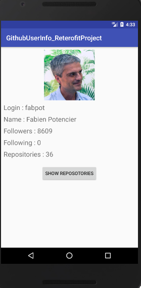
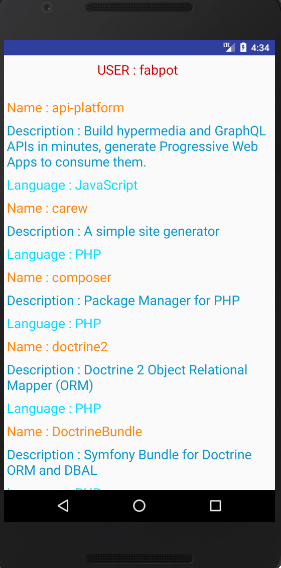

# GithubUserInfo_ReterofitProject
An Android App that uses the Retrofit Library to download JSON Objects containing GitHub user details from The Github API.
It has three following activities:

# MainActivity
In this screen, customer needs to put thei GitHub username to get information.

# InformationActivity
This screen shows user information linke name, followers etc.

# RepositoryActivity
This activity shows all repositories of the user in a recyclerview.

